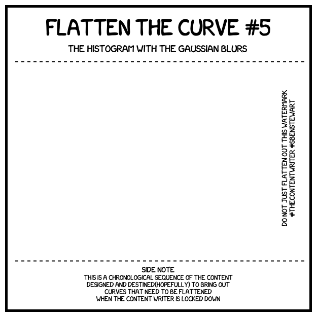
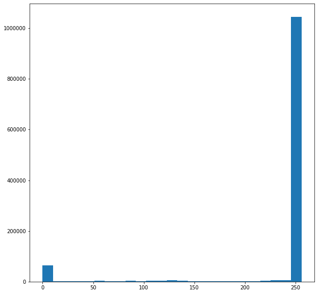
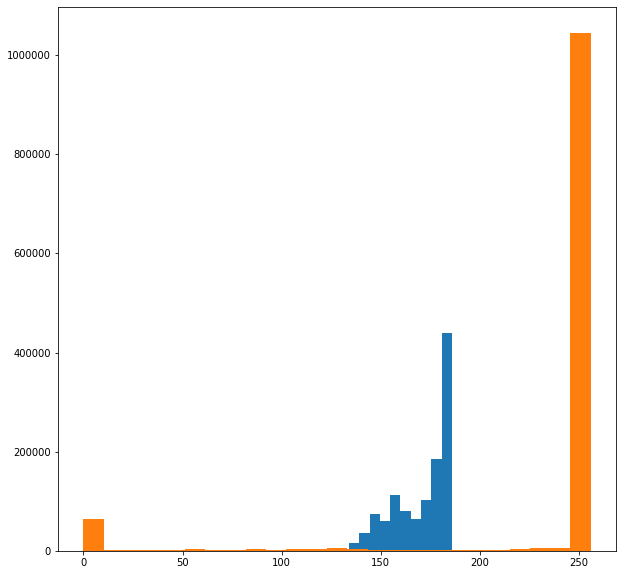

# the-content

the-content-writer under lockdown trying to flatten down all possible curves. Or at least trying to do what is necessary.

## the-image

## the-transcript with the-explanation

Giving a line by line interpretation of almost all that was tried to be conveyed.

**Flatten the curve #5**

_the-content-writer flattening the curves for the fifth time._

**The histogram with the Gaussian blurs**

_This is the curve that the-content-writer has taken for today which will be explained but not in great detail._

**the-content-explained**

the-content usually has the colours `white, black, red and blue`. This means that a certain number of pixels will have the same color as a few others. This can be counted up as to one specific color in the image is present in these many number of pixels. And this is what we will be finding out.

But. Wait. For this counting purpose, we will be needing some image to use. And for the same reason, we will be using the-template for the-content for the great Indian lockdown.

This image gives a histogram plot as the follows.

The representation of digital images is done using three channels for the three primary colors, red, green and blue. As this would complicate things, it was considered to change the image black and white or more specifically to the different shades of black and white. This format will only represent the intensity of color in each channel for each pixel. But in a time when the Indian goverment wants a few things done but doesn't tell how to get those things done, not bicker that the-content-writer hasn't explained this properly enough.

Now we blur the-template in hopes that this would flatten the histogram plot. And this is kind of what we get in the plot of the same when blurred.

The one shaded blue is the one for the blurred template. And the orange is that of the unblurred template. Just given for reference.

But, this being the-content theme has to be inserted into the-template. Resulting in an intermediate content. This won't be accurate. And this is all the-content-writer would tell.

This process is iterated till the error rate is very small. The final image to be posted as the-content is as follows.

But. Behold. It is not over yet. This content, will not have the histogram flat enough. It will only be the blurred content that is. And so. It is imperative to post the-blurred-content. And have it explained.

For any doubts. Google.

**Do not just flatten out this watermark**

The word `flatten` has been used to bring out the lockdown's `flatten curves` trend.

**#thecontentwriter#sbenstewart**

_The actual watermark. This suffices explanation._

**Side Note**

_This is the space below the dashed line where the side notes are placed for making it easier for the-content-viewer to understand the content and also to summarise them into the said points._

**This is a chronological sequence of the content designed and destined(hopefully) to bring out curves that need to be flattened when the content writer is locked down**

_Chronological meaning the organised content being published with an issue number which has been designed and hopefully wanted by the-content-writer to chnage the curves that need to be changed and in some cases flattened._

**Have a great day :)**
