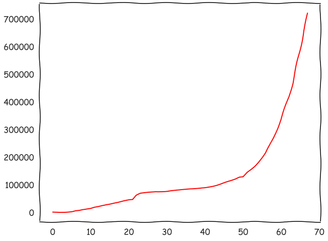
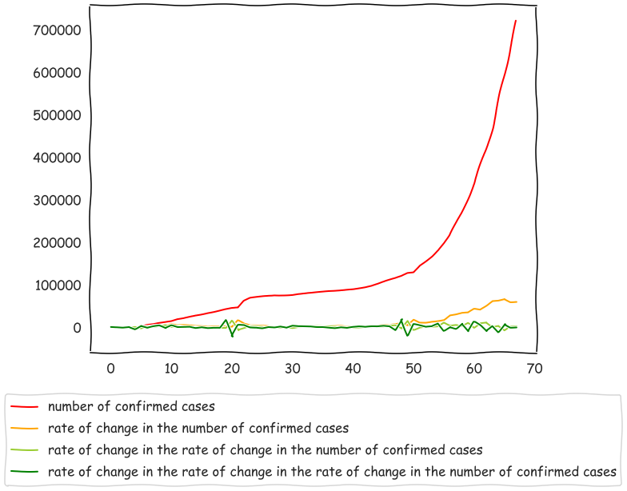

# the-content

the-content-writer under lockdown trying to flatten down all possible curves. Or at least trying to do what is necessary.

## the-image


## the-transcript with the-explanation

Giving a line by line interpretation of almost all that was tried to be conveyed.

**Flatten the curve #5**

_the-content-writer flattening the curves for the eight time._

**Publish the greenest curve with the steepest drop**

_This is what is to be done with the global curve as of the 31st of March,2020. If the governments or whoever the hell in charge wants to paint a `greener` picture of what the reality is._

**the-content-explained**

Let the explanation begin.

**the-dataset**

The data in [`the-dataset folder`](the-dataset) was downloaded from the the [internet](https://www.kaggle.com/sudalairajkumar/novel-corona-virus-2019-dataset) where it is common for links to disappear. [And so the data has been provided in this subfolder too.](the-dataset) This data is valid as of the day the-content was published. And might change probably for the worse.

**the-code**

Having so much time to kill, the-content-writer set out to find a few unremarkable points from the above mentioned soon to be invalid dataset. If you are interested, you are suggested to deepdive into [the-code](the-code.ipynb), which the-content-writer doesn't highly recommend.

**the-finding**

Though you probably might know that `the function representing the number of people infected by any disease or idea is stricly increasing`, the-content-writer wanted to point the same out.

But. The problem with the curve is that it is too steep and would scare the living hell out of many people. And so to fix this problem, the-content-writer searched for a solution, in fact, any solution, that might work, and sure did the-content-writer find one.

The points to know
1. The steeper the curve, the less scarier
2. The more complex the term, the less scarier
3. The greener the colour, the less scarier

**the-representation**

Armed with the above knowledge and a bit of the differentiation which probaly most of the-readers skipped or bunked or even slept through in class, only to find out that integration is even more difficult, look at the [folllowing gif](the-gif.gif) created from the images in [the-curves subfolder](the-curves).



And we can clearly see that the curve is becoming less steeper, and more greener thanks to the more complex terms being used which also helps in making it less scarier.

The terms have been omitted in the gif, as reading at such speeds will be right next to impossible.

And so. Here are the terms,
* number of confirmed cases
* rate of change in the number of confirmed cases
* rate of change in the rate of change in the number of confirmed cases
* rate of change in the rate of change in the rate of change in the number of confirmed cases

Or in more simpler regex terms  it will be as follows.

```
(rate of change in the ){0,3}(number of confirmed cases)

# the string "rate of change in the" occuring 0,1,2 or 3 times followed by the string  "number of confirmed cases"
```

It could have been abstracted with a natural number n in the place of three. But why compicate things.

**the-content**

Now, the-content-writer faced the probelem that never before has a gif been embedded into the-content, and still not wanting to try it out, had inserted the overlapped graph into the same.



**the-usage**

Thus the government or any other incompetent organisation that wants to disillusion the people could use the green curve to point out that all is still going out well.

And here by, ends the explantion.

**Do not just flatten out this watermark**

The word `flatten` has been used to bring out the lockdown's `flatten curves` trend.

**#thecontentwriter#sbenstewart**

_The actual watermark. This suffices explanation._

**Side Note**

_This is the space below the dashed line where the side notes are placed for making it easier for the-content-viewer to understand the content and also to summarise them into the said points._

**This is a chronological sequence of the content designed and destined(hopefully) to bring out curves that need to be flattened when the content writer is locked down**

_Chronological meaning the organised content being published with an issue number which has been designed and hopefully wanted by the-content-writer to chnage the curves that need to be changed and in some cases flattened._

**Have a great day :)**
