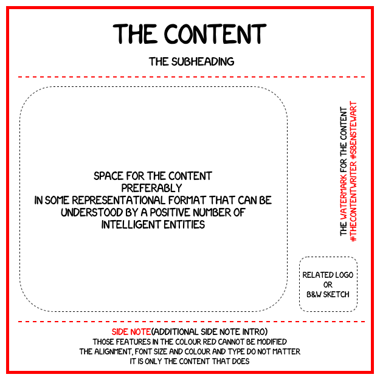

# the-content

The base template designed over the many iterations and found suitable for most of the-content.

## the-image

## the-transcript with the-explanation

Giving a line by line interpretation of almost all that was tried to be conveyed.

**The Content**

_This gives the heading for the-content. As simple as that._

**The SubHeading**

_Gives additional footing for the-content along with the heading. Usually has some pun intended in it._

**Space for the content preferably in some representational format that can be understood by a positive number of intelligent entities**

_The rounded rectangular space marked by the dotted line is the area where the main content is placed. This can be in any method of representation which means language, diagrams, flow charts and so on. But, the main point to be noted is that the-content must be understood by atleast one person who views the-content. Thus the above has been abstracted into the `positive number of intelligent entities`. Many assumptions have been made for this abstraction, like almost all the abstractions that have ever been made. They are listed as follows._
* _Inteliigence is understanding the-content_
* _Intelligent entity is anything that exhibits intelligence_

**Related Logo or B&W Sketch**

_The rounded rectangular space marked by the dotted line in the lower right corner marks the space where the above can be placed. I assume that no explantion for this is needed._

**The watermark for the content**

_The line that precedes the actual watermark. This is so that the-content-viewer can get one more word based pun._

**#thecontentwriter#sbenstewart**

_The actual watermark. This suffices explanation._

**Side Note (Additional side note intro)**

_This is the space below the dashed line where the side notes are placed for making it easier for the-content-viewer to understand the content and also to summarise them into the said points._

**Those features in the colour red cannot be modified**

_All text, boxes and lines in the red colour cannot be changed. This is because they kind of form the base template for the content._

**The alignment, font size and colour and type do not matter**

_The alignment such as the center, left, right or that justified can be neglected. And so too, can be the font size, colour and type. But, in reality the-content-writer would prefer centered text with the 14 point size._

**It is only the content that does**

_Though whatever might be the stringent criteria of the-content-writer, it is the content that really does matter._

## P.S.

This [README.md](README.md) is the template for explaining the-content. 

**Have a great day :)**
